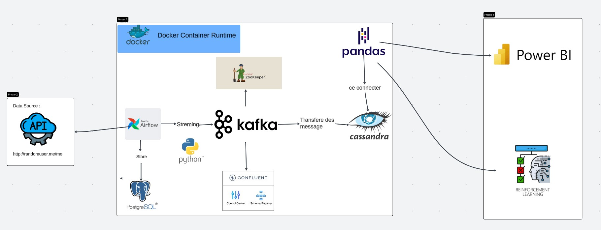
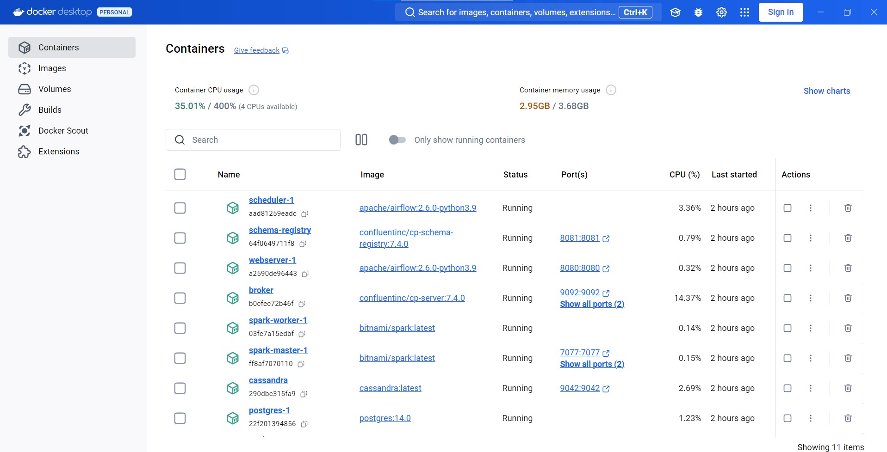
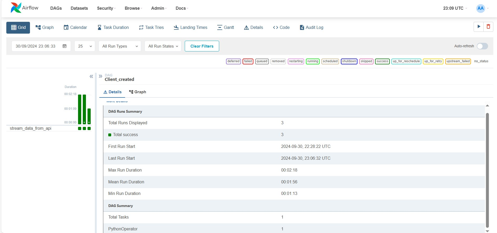
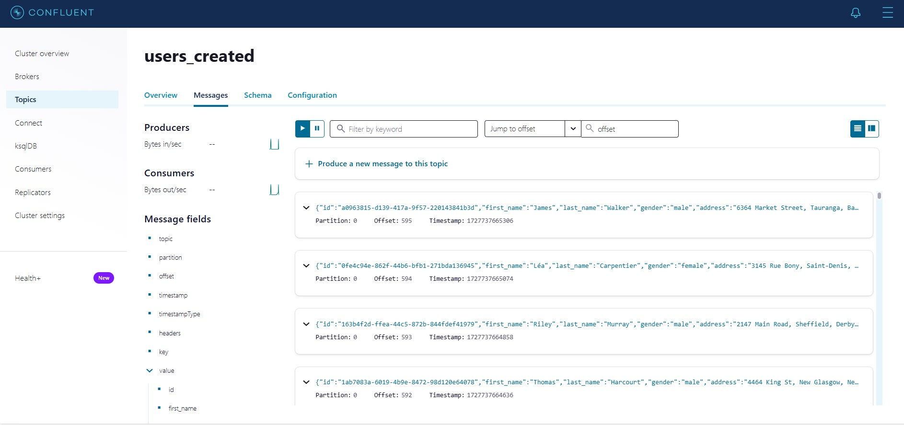
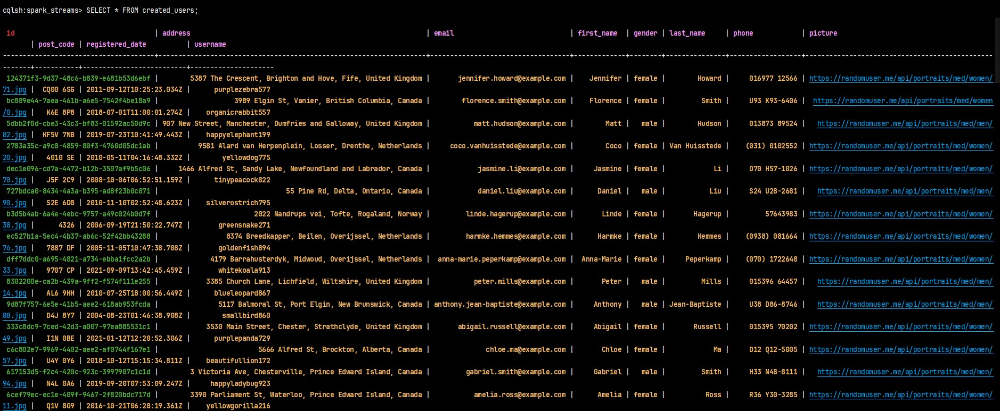
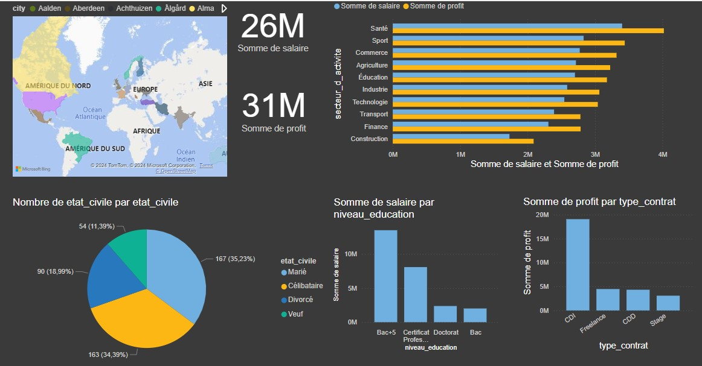
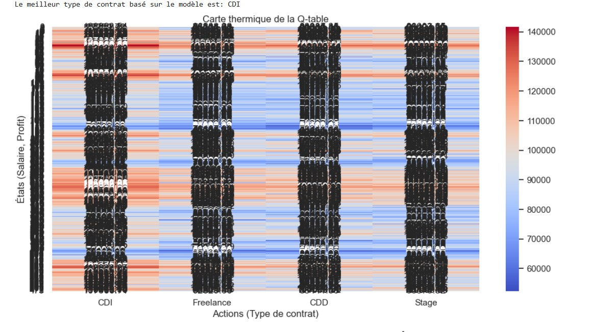

# Projet Pipeline de Données & Apprentissage par Renforcement

## Aperçu du Projet
Ce projet illustre un pipeline de données en temps réel complet utilisant **Apache Kafka**, **Apache Cassandra**, **Apache Airflow**, et **Confluent Control Center**. De plus, les données collectées sont analysées à l'aide de **Power BI**, et un algorithme d'**apprentissage par renforcement** est appliqué pour prendre des décisions basées sur ces données.

## Architecture du Projet
L'architecture du projet comprend l'ingestion de données depuis une API externe, le traitement et le stockage des données dans Apache Cassandra, ainsi que la visualisation des résultats avec Power BI. Un algorithme d'apprentissage par renforcement est ensuite utilisé pour prendre des décisions concernant le type de contrat en fonction des données collectées.

## Technologies Utilisées :
- **Kafka** pour le streaming de données et le traitement en temps réel.
- **Cassandra** pour le stockage de données distribué et évolutif.
- **Airflow** pour l'orchestration et la planification des tâches.
- **Docker** pour la conteneurisation et le déploiement facile.
- **Confluent Control Center** pour la surveillance des topics Kafka.
- **Power BI** pour la visualisation et l'analyse des données.
- **Apprentissage par Renforcement** pour la prise de décisions basée sur les données.

## Déploiement Docker
L'infrastructure du projet est entièrement conteneurisée à l'aide de Docker. Voici les services principaux inclus dans le fichier `docker-compose.yml` :
- **Zookeeper** : gestionnaire de coordination pour Kafka.
- **Broker Kafka** : gestionnaire des topics Kafka pour le streaming de données.
- **Schema Registry** : gestionnaire des schémas de données pour Kafka.
- **Airflow** : orchestrateur pour automatiser les tâches de traitement des données.
- **Cassandra** : base de données NoSQL utilisée pour stocker les utilisateurs créés.
- **Confluent Control Center** : interface pour surveiller les topics Kafka.

## Airflow et DAGs
Le projet utilise **Apache Airflow** pour automatiser l'ingestion de données depuis une API, les formater, puis les envoyer dans Kafka. Le DAG (Directed Acyclic Graph) est utilisé pour ordonnancer ces tâches.

## Kafka Control Center
**Confluent Control Center** est utilisé pour visualiser et surveiller les topics Kafka, incluant le topic utilisé pour les utilisateurs créés.

## Visualisation des Données dans Cassandra
Les données collectées sont stockées dans **Cassandra**, et voici une capture d'écran montrant les informations des utilisateurs créés dans la base de données.

## Analyse des Données avec Power BI
Les données sont ensuite visualisées avec **Power BI** pour des analyses plus approfondies et des visualisations interactives.

## Algorithme d'Apprentissage par Renforcement
Un algorithme de **Q-Learning** est utilisé pour recommander le meilleur type de contrat en se basant sur les données d'utilisateurs collectées. Cet algorithme apprend de manière itérative et améliore ses recommandations au fil du temps.
 